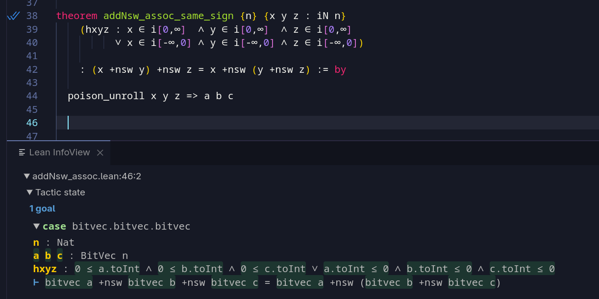

# peephole-formal

> ››› **Formally Verifying Peephole Optimisations In Lean**
>
> *Introduction to formally specifying peephole optimisations (under LLVM/C style UB semantics) in Lean, and an introduction to my new project which verifies them.* 
>
> [/cs/formally-verifying-peephole-optimisations-in-lean/](https://l-m.dev/cs/formally-verifying-peephole-optimisations-in-lean/)


This project contains the formalisation of basic peephole optimisations that you would find in any compiler, extended with the semantics of undefined behaviour (from LLVM/C).

The goal is to build up a decent theory inside Lean, that is amenable to manual and automated proof techniques, and be a universal framework to plug into and collect rewrite rules found by machine search like superoptimisers.



> **Keep track of this projects development:**
> - (schedule) https://l-m.dev/stream/
> - (twitch) https://www.twitch.tv/lmdotdev/
> - (VODs) https://www.youtube.com/@l-mdotdev/
>
> ---
>
> 1. [stream #1765922400](https://l-m.dev/stream/1765922400) | [[VOD] PEEP 1 - verification of peephole optimisations in lean](https://www.youtube.com/watch?v=IcyFhrWyzdg)
> 2. [stream #1766095200](https://l-m.dev/stream/1766095200) | [[VOD] PEEP 2 - proof of addNsw_assoc (add nsw LLVM instruction)](https://www.youtube.com/watch?v=lY1GF-8sdsA)
> 3. [stream #1766527200](https://l-m.dev/stream/1766527200) | [[VOD] PEEP 3 - proof automation, realising why it won't work in general](https://www.youtube.com/watch?v=2rChq0gwhxo)
> 4. [stream #1766700000](https://l-m.dev/stream/1766700000) | [ [VOD] PEEP 4 - stumbling around [[ denotational ]] : semantics](https://www.youtube.com/watch?v=9EN1jA2Q57c)
> 5. [stream #1767132000](https://l-m.dev/stream/1767132000) | [  [VOD] PEEP 5 - reification and denoting of expressions](https://www.youtube.com/watch?v=Ag0aRR65YgM)
> 6. [stream #1767304800](https://l-m.dev/stream/1767304800) | [  [VOD] PEEP 5 - reification and denoting of expressions](https://www.youtube.com/watch?v=Ag0aRR65YgM)


# basic semantics

> More information: [/cs/formally-verifying-peephole-optimisations-in-lean/](https://l-m.dev/cs/formally-verifying-peephole-optimisations-in-lean/)

In any definition of C/LLVM style integer semantics, you need to care a lot about what happens for undefined behaviour. Generally, it is a violation of the spec to introduce undefined behaviour when there wasn't any initially. However, if there is UB, you are allowed to **define** it.

Hence, let's define it like this. A compiler would want to

1. Rewrite some expression to an exactly equivalent one.
2. Take advantage of UB to pick (define!) whatever value we want.

Following what LLVM does, we can define

```lean
/--
LLVM-style integers with poison value.
-/
inductive iN (bits : Nat) : Type where
  | bitvec : BitVec bits → iN bits
  | poison : iN bits

/--
`Rewrite x y` means the value `x` can be rewritten into the value `y`.
-/
inductive Rewrite {n} : iN n → iN n → Prop where
  /-- A value rewrites to itself. -/
  | refl (x : iN n) : Rewrite x x
  /-- Poison can be rewritten into any concrete value. -/
  | poison_forge (v : BitVec n) : Rewrite poison (bitvec v)

@[inherit_doc] infix:50 " ~> "  => Rewrite
```

We can deduce the following two theorems:

```lean
/-- Poison can be rewritten to anything. -/
theorem poison_rewrite {n} (x : iN n)
  : poison ~> x

/-- Values cannot be rewritten to poison. -/
theorem not_bitvec_poision_rewrite {n} (a : BitVec n)
  : ¬bitvec a ~> poison
```

Their interpretations are as follows:

1. **True.** `poison ~> x` by definition of rewrite (you can make a program more defined).
2. **False.** `bitvec a ~> poison` is always false by definition (you cannot make a program less defined).
